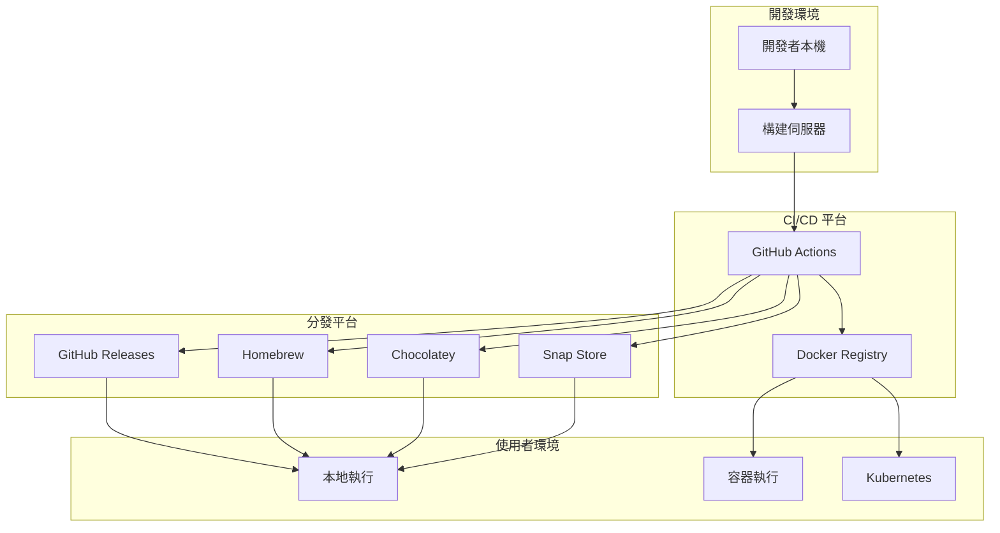

# 部署計劃 (Deployment Plan)

## 1. 部署概覽

### 1.1 部署目標
Generator CLI 是一個命令列工具，主要通過以下方式分發：
- **GitHub Releases**: 直接下載 JAR 檔案
- **Docker Hub**: 容器化部署
- **包管理器**: Homebrew、Chocolatey、Snap

### 1.2 部署架構



## 2. 發布流程

### 2.1 版本管理
採用語義化版本控制：`MAJOR.MINOR.PATCH`

- **MAJOR**: 重大變更或不相容修改
- **MINOR**: 新功能添加（向下相容）
- **PATCH**: 錯誤修正

### 2.2 自動化發布流程

```yaml
name: Release Pipeline
on:
  push:
    tags:
      - 'v*'

jobs:
  release:
    runs-on: ubuntu-latest
    steps:
      - name: Checkout code
        uses: actions/checkout@v4
      
      - name: Set up JDK 17
        uses: actions/setup-java@v4
        with:
          java-version: '17'
          distribution: 'temurin'
      
      - name: Build JAR
        run: ./gradlew bootJar
      
      - name: Create GitHub Release
        uses: softprops/action-gh-release@v1
        with:
          files: build/libs/*.jar
          generate_release_notes: true
```

## 3. 分發方式

### 3.1 GitHub Releases

#### 手動安裝
```bash
# 下載最新版本
curl -L -o generator-cli.jar https://github.com/cloudtechnology/generator-cli/releases/latest/download/generator-cli.jar

# 執行
java -jar generator-cli.jar
```

#### 安裝腳本
```bash
#!/bin/bash
# install.sh

VERSION="latest"
INSTALL_DIR="/usr/local/bin"
JAR_NAME="generator-cli.jar"

# 下載最新版本
echo "下載 Generator CLI..."
curl -L -o "$JAR_NAME" "https://github.com/cloudtechnology/generator-cli/releases/$VERSION/download/$JAR_NAME"

# 創建執行腳本
cat > generator << 'EOF'
#!/bin/bash
java -jar /usr/local/bin/generator-cli.jar "$@"
EOF

# 安裝檔案
sudo mv "$JAR_NAME" "$INSTALL_DIR/"
sudo mv generator "$INSTALL_DIR/"
sudo chmod +x "$INSTALL_DIR/generator"

echo "Generator CLI 安裝完成！"
echo "使用 'generator' 命令開始使用。"
```

### 3.2 Docker 部署

#### Dockerfile
```dockerfile
FROM eclipse-temurin:17-jre-alpine

LABEL maintainer="CloudTechnology Team"
LABEL version="1.0.0"
LABEL description="Generator CLI - Spring Boot Project Generator"

# 建立應用程式目錄
WORKDIR /app

# 複製 JAR 檔案
COPY build/libs/generator-cli.jar app.jar

# 建立非 root 使用者
RUN addgroup -g 1001 -S generator && \
    adduser -S generator -u 1001 -G generator

# 設定權限
RUN chown -R generator:generator /app
USER generator

# 暴露埠號（如果需要 Web 介面）
EXPOSE 8080

# 設定入口點
ENTRYPOINT ["java", "-jar", "app.jar"]
```

#### Docker Compose
```yaml
version: '3.8'
services:
  generator-cli:
    image: cloudtechnology/generator-cli:latest
    container_name: generator-cli
    volumes:
      - ./output:/app/output
      - ./input:/app/input
    environment:
      - JAVA_OPTS=-Xmx512m
    working_dir: /app

  postgres:
    image: postgres:13
    container_name: postgres-db
    environment:
      POSTGRES_DB: sampledb
      POSTGRES_USER: admin
      POSTGRES_PASSWORD: password
    ports:
      - "5432:5432"
    volumes:
      - postgres_data:/var/lib/postgresql/data

volumes:
  postgres_data:
```

### 3.3 包管理器

#### Homebrew (macOS/Linux)
```ruby
# Formula/generator-cli.rb
class GeneratorCli < Formula
  desc "Spring Boot project generator CLI tool"
  homepage "https://github.com/cloudtechnology/generator-cli"
  url "https://github.com/cloudtechnology/generator-cli/releases/download/v1.0.0/generator-cli.jar"
  sha256 "abc123..."
  license "MIT"

  depends_on "openjdk@17"

  def install
    libexec.install "generator-cli.jar"
    bin.write_jar_script libexec/"generator-cli.jar", "generator"
  end

  test do
    system "#{bin}/generator", "--version"
  end
end
```

#### Chocolatey (Windows)
```xml
<?xml version="1.0" encoding="utf-8"?>
<package xmlns="http://schemas.microsoft.com/packaging/2015/06/nuspec.xsd">
  <metadata>
    <id>generator-cli</id>
    <version>1.0.0</version>
    <title>Generator CLI</title>
    <authors>CloudTechnology Team</authors>
    <description>Spring Boot project generator CLI tool</description>
    <tags>java spring-boot generator cli</tags>
    <dependencies>
      <dependency id="openjdk17" version="17.0.0" />
    </dependencies>
  </metadata>
  <files>
    <file src="tools\**" target="tools" />
  </files>
</package>
```

## 4. 部署環境配置

### 4.1 系統需求

#### 最小需求
- **作業系統**: Windows 10+, macOS 11+, Linux (Ubuntu 20.04+)
- **Java**: JDK 17 或更高版本
- **記憶體**: 512MB RAM
- **儲存空間**: 100MB 可用空間

#### 建議需求
- **記憶體**: 1GB RAM
- **儲存空間**: 1GB 可用空間
- **網路**: 穩定的網際網路連線

### 4.2 環境變數配置

```bash
# 設定 Java 路徑
export JAVA_HOME=/usr/lib/jvm/java-17-openjdk

# 設定 Generator CLI 配置
export GENERATOR_HOME=/opt/generator-cli
export GENERATOR_OUTPUT_DIR=/home/user/projects
export GENERATOR_TEMPLATES_DIR=/opt/generator-cli/templates

# 資料庫配置（可選）
export DEFAULT_DB_URL=jdbc:postgresql://localhost:5432/mydb
export DEFAULT_DB_USERNAME=admin
export DEFAULT_DB_PASSWORD=password
```

## 5. 監控和維運

### 5.1 健康檢查

#### Docker 健康檢查
```dockerfile
HEALTHCHECK --interval=30s --timeout=3s --start-period=5s --retries=3 \
  CMD java -cp app.jar org.springframework.boot.loader.JarLauncher --health || exit 1
```

#### Kubernetes 健康檢查
```yaml
livenessProbe:
  exec:
    command:
    - java
    - -cp
    - app.jar
    - org.springframework.boot.loader.JarLauncher
    - --health
  initialDelaySeconds: 30
  periodSeconds: 30

readinessProbe:
  exec:
    command:
    - java
    - -cp
    - app.jar
    - org.springframework.boot.loader.JarLauncher
    - --ready
  initialDelaySeconds: 5
  periodSeconds: 10
```

### 5.2 日誌管理

#### 日誌配置
```yaml
# application.yml
logging:
  level:
    io.github.cloudtechnology.generator: DEBUG
    org.springframework.shell: INFO
    org.jooq: DEBUG
  file:
    name: logs/generator-cli.log
  pattern:
    file: '%d{yyyy-MM-dd HH:mm:ss} [%thread] %-5level %logger{36} - %msg%n'
    console: '%d{HH:mm:ss.SSS} [%thread] %-5level %logger{36} - %msg%n'
```

### 5.3 效能監控

#### Micrometer 指標
```yaml
management:
  endpoints:
    web:
      exposure:
        include: health,info,metrics,prometheus
  endpoint:
    health:
      show-details: always
  metrics:
    export:
      prometheus:
        enabled: true
```

## 6. 安全性考量

### 6.1 程式碼簽名

#### JAR 檔案簽名
```bash
# 生成金鑰對
keytool -genkeypair -alias generator-cli -keyalg RSA -keysize 2048 -keystore keystore.jks

# 簽名 JAR 檔案
jarsigner -keystore keystore.jks generator-cli.jar generator-cli

# 驗證簽名
jarsigner -verify generator-cli.jar
```

### 6.2 容器安全

#### 安全掃描
```yaml
# .github/workflows/security.yml
name: Security Scan
on: [push, pull_request]

jobs:
  security:
    runs-on: ubuntu-latest
    steps:
      - uses: actions/checkout@v4
      
      - name: Build Docker image
        run: docker build -t generator-cli:test .
      
      - name: Run Trivy vulnerability scanner
        uses: aquasecurity/trivy-action@master
        with:
          image-ref: 'generator-cli:test'
          format: 'sarif'
          output: 'trivy-results.sarif'
      
      - name: Upload scan results
        uses: github/codeql-action/upload-sarif@v2
        with:
          sarif_file: 'trivy-results.sarif'
```

## 7. 故障排除

### 7.1 常見問題

#### Java 版本不相容
```bash
# 檢查 Java 版本
java -version

# 如果版本低於 17，需要升級
# Ubuntu/Debian
sudo apt update && sudo apt install openjdk-17-jdk

# CentOS/RHEL
sudo yum install java-17-openjdk-devel

# macOS (使用 Homebrew)
brew install openjdk@17
```

#### 記憶體不足
```bash
# 增加 JVM 記憶體配置
java -Xmx1024m -jar generator-cli.jar

# 或設定環境變數
export JAVA_OPTS="-Xmx1024m -Xms512m"
java $JAVA_OPTS -jar generator-cli.jar
```

#### 資料庫連線問題
```bash
# 測試資料庫連線
telnet localhost 5432

# 檢查防火牆設定
sudo ufw status

# 檢查 PostgreSQL 服務狀態
sudo systemctl status postgresql
```

### 7.2 偵錯模式

#### 啟用詳細日誌
```bash
java -jar generator-cli.jar --debug --logging.level.root=DEBUG
```

#### 遠端偵錯
```bash
java -agentlib:jdwp=transport=dt_socket,server=y,suspend=n,address=5005 -jar generator-cli.jar
```

## 8. 版本升級

### 8.1 升級程序

#### 1. 備份現有配置
```bash
# 備份自定義模板
cp -r ~/.generator-cli/templates ~/.generator-cli/templates.backup

# 備份配置檔案
cp ~/.generator-cli/config.yml ~/.generator-cli/config.yml.backup
```

#### 2. 下載新版本
```bash
# 下載最新版本
curl -L -o generator-cli-new.jar https://github.com/cloudtechnology/generator-cli/releases/latest/download/generator-cli.jar

# 驗證檔案完整性
sha256sum generator-cli-new.jar
```

#### 3. 測試新版本
```bash
# 在測試環境中運行
java -jar generator-cli-new.jar --version
java -jar generator-cli-new.jar --help
```

#### 4. 部署新版本
```bash
# 停止舊版本（如果作為服務運行）
sudo systemctl stop generator-cli

# 替換檔案
mv generator-cli.jar generator-cli-old.jar
mv generator-cli-new.jar generator-cli.jar

# 啟動新版本
sudo systemctl start generator-cli
```

### 8.2 回滾程序

如果新版本出現問題：

```bash
# 停止新版本
sudo systemctl stop generator-cli

# 恢復舊版本
mv generator-cli.jar generator-cli-failed.jar
mv generator-cli-old.jar generator-cli.jar

# 恢復配置
mv ~/.generator-cli/config.yml.backup ~/.generator-cli/config.yml

# 啟動舊版本
sudo systemctl start generator-cli
```

## 9. 支援和維護

### 9.1 技術支援

#### 文檔資源
- [官方文檔](https://github.com/cloudtechnology/generator-cli/wiki)
- [API 參考](https://github.com/cloudtechnology/generator-cli/blob/main/docs/api.md)
- [FAQ](https://github.com/cloudtechnology/generator-cli/blob/main/docs/faq.md)

#### 社群支援
- [GitHub Issues](https://github.com/cloudtechnology/generator-cli/issues)
- [Discussion Forum](https://github.com/cloudtechnology/generator-cli/discussions)
- [Stack Overflow](https://stackoverflow.com/questions/tagged/generator-cli)

### 9.2 維護計劃

#### 定期維護
- **每月**: 依賴套件安全更新
- **每季**: 功能增強和效能改進
- **每年**: 主要版本升級

#### 生命週期管理
- **LTS 版本**: 3 年支援
- **一般版本**: 18 個月支援
- **安全修補**: 24 小時內發布

---

**最後更新**: 2024-12-13  
**文檔版本**: v1.0.0  
**維護者**: CloudTechnology Team 