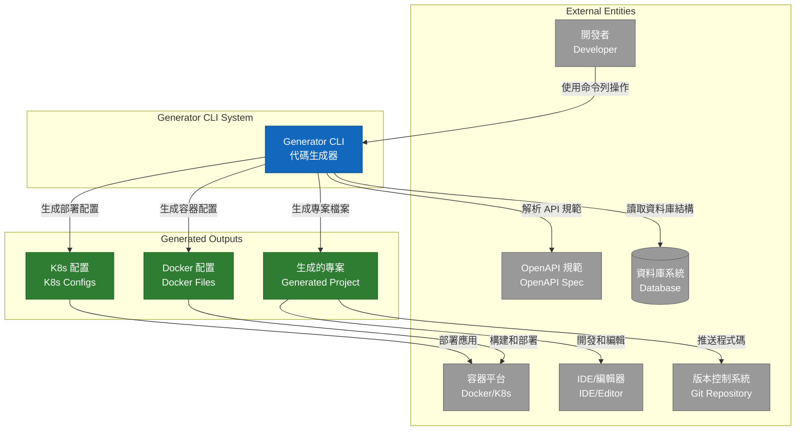
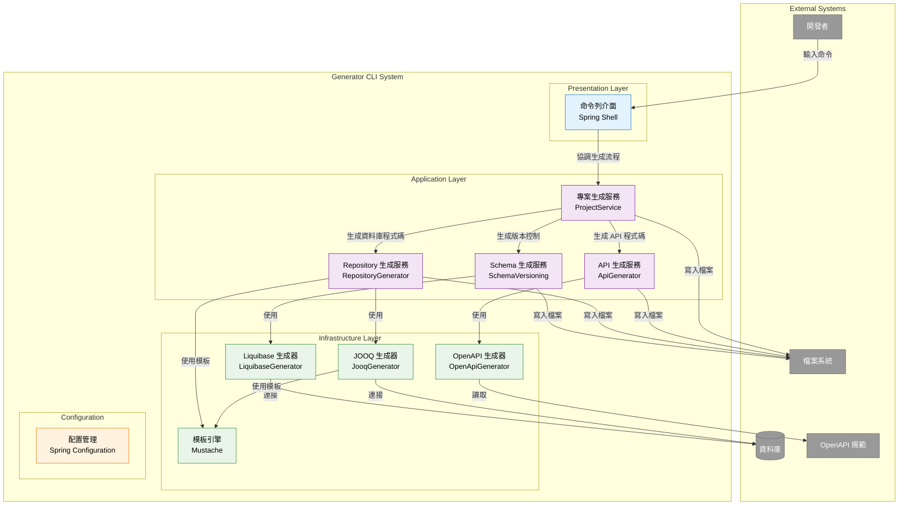

# 2. 上下文和範圍 (System Scope and Context)

## 2.1 業務上下文 (Business Context)

Generator CLI 作為開發工具鏈中的核心元件，與多個外部系統和利害關係人互動：

### 外部實體說明

| 外部實體 | 描述 | 介面/協議 |
|---------|------|-----------|
| 開發者 | 主要使用者，透過命令列操作工具 | 命令列介面 (CLI) |
| 資料庫系統 | 提供結構資訊用於代碼生成 | JDBC |
| OpenAPI 規範檔案 | 提供 API 定義 | YAML/JSON 檔案 |
| 檔案系統 | 儲存生成的專案檔案 | 檔案 I/O |
| 版本控制系統 | 管理生成的程式碼版本 | Git |
| 容器平台 | 運行生成的容器化應用 | Docker API |
| IDE/編輯器 | 開發和編輯生成的程式碼 | 檔案系統 |

## 2.2 技術上下文 (Technical Context)

### 對外介面

#### CLI 命令介面
```bash
# 主要命令
generator                    # 啟動互動式專案生成
generator --help            # 顯示幫助資訊
generator --version         # 顯示版本資訊
```

#### 資料庫連線
```properties
# 支援的資料庫
- PostgreSQL: jdbc:postgresql://host:port/database
- MySQL: jdbc:mysql://host:port/database
- Oracle: jdbc:oracle:thin:@host:port:database
```

#### 檔案輸入/輸出
```yaml
# OpenAPI 規範檔案
- 支援格式: YAML, JSON
- 版本: OpenAPI 3.1+

# 輸出檔案結構
project-root/
├── src/main/java/           # Java 原始碼
├── src/main/resources/      # 資源檔案
├── build.gradle            # 構建腳本
├── Dockerfile              # 容器化配置
└── k8s/                    # Kubernetes 配置
```

## 2.3 C4 Model 系統上下文圖 (System Context Diagram)



## 2.4 C4 Model 容器圖 (Container Diagram)



## 2.5 對外介面詳細說明

### 2.5.1 命令列介面 (CLI Interface)

#### 互動式模式
```bash
shell:> generator
? Please choose a build tool: GRADLE
? Please enter group id: com.example
? Please enter artifact id: demo
? Please enter project name: demo
? Please enter project description: Demo project for Spring Boot
? Please enter package name: com.example.demo
? Please choose a Java version: 17
? Please enter OpenAPI file path: /path/to/openapi.yaml
? Please enter database URL: jdbc:postgresql://localhost:5432/db
? Please enter database username: user
? Please enter database password: ******
? Please choose a runtime environment: KUBERNETES
```

#### 參數模式
```bash
generator \
  --build-tool=GRADLE \
  --group-id=com.example \
  --artifact-id=demo \
  --project-name=demo \
  --description="Demo project" \
  --package-name=com.example.demo \
  --java-version=17 \
  --openapi-file=/path/to/openapi.yaml \
  --db-url=jdbc:postgresql://localhost:5432/db \
  --db-username=user \
  --db-password=secret \
  --runtime=KUBERNETES
```

### 2.5.2 資料庫介面

#### 支援的資料庫類型
- **PostgreSQL 9.6+**: 支援完整的 SQL 功能
- **MySQL 8.0+**: 支援現代 SQL 標準
- **Oracle 11g+**: 企業級資料庫支援
- **SQL Server 2017+**: Microsoft 資料庫支援

#### 資料庫權限需求
```sql
-- 最小權限需求
GRANT SELECT ON INFORMATION_SCHEMA.* TO generator_user;
GRANT SELECT ON pg_catalog.* TO generator_user;  -- PostgreSQL
GRANT SELECT ON sys.* TO generator_user;         -- Oracle
```

### 2.5.3 檔案系統介面

#### 輸入檔案
- **OpenAPI 規範**: `.yaml`, `.yml`, `.json`
- **配置檔案**: `.properties`, `.yml`
- **模板檔案**: `.mustache`

#### 輸出檔案結構
```
generated-project/
├── .devcontainer/
│   ├── devcontainer.json
│   └── postCreateCommand.sh
├── src/main/java/
│   └── com/example/demo/
│       ├── Application.java
│       ├── interfaces/rest/
│       │   ├── BookApi.java
│       │   └── dto/
│       └── infrastructure/repositories/
│           ├── UserRepository.java
│           └── tables/pojos/
├── src/main/resources/
│   ├── application.yml
│   └── db/changelog/
├── build.gradle
├── Dockerfile
├── compose.yaml
└── k8s/
    ├── deployment.yaml
    └── service.yaml
```

## 2.6 系統邊界

### 包含在系統範圍內
- ✅ 專案結構生成
- ✅ OpenAPI 程式碼生成
- ✅ 資料庫程式碼生成
- ✅ 容器化配置生成
- ✅ 基本的 CI/CD 配置
- ✅ 開發環境配置

### 不包含在系統範圍內
- ❌ 業務邏輯實現
- ❌ 資料庫資料遷移
- ❌ 生產環境部署
- ❌ 監控和日誌系統配置
- ❌ 安全性詳細配置
- ❌ 效能調優

## 2.7 假設和依賴

### 技術假設
- 使用者具備基本的 Java 和 Spring Boot 知識
- 目標資料庫已經存在且可連接
- OpenAPI 規範檔案格式正確
- 檔案系統具有適當的讀寫權限

### 外部依賴
- **Java Runtime**: JDK 17 或更高版本
- **網路連線**: 用於下載依賴和連接資料庫
- **資料庫驅動**: 對應資料庫的 JDBC 驅動
- **容器運行時**: Docker 或相容的容器運行時

### 運行環境假設
- 充足的磁碟空間 (至少 1GB)
- 足夠的記憶體 (至少 512MB)
- 適當的網路權限
- 對目標目錄的寫入權限 