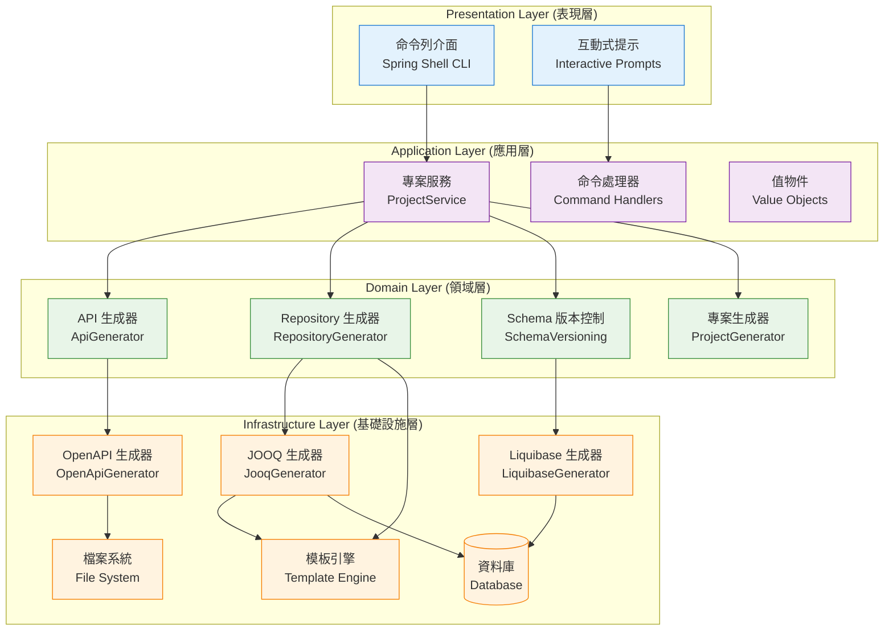
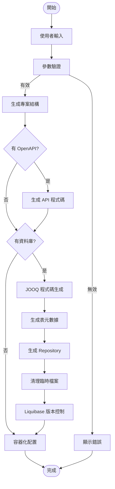
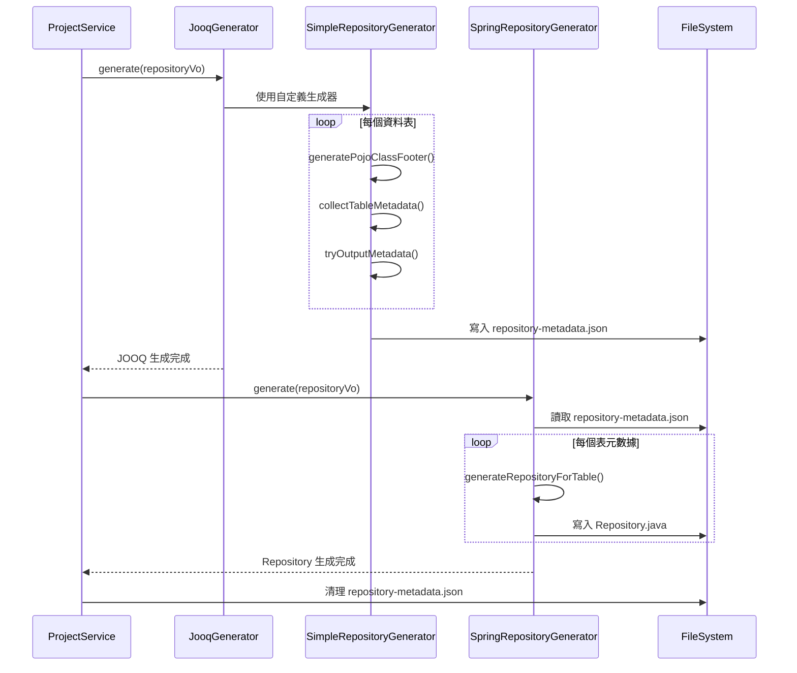

# 3. 建構塊視圖 (Building Block View)

## 3.1 系統整體結構

Generator CLI 採用分層架構設計，遵循 Clean Architecture 原則：



## 3.2 層級說明

### 3.2.1 表現層 (Presentation Layer)
負責使用者介面和命令處理

#### 主要元件：
- **ProjectGenerator (CLI)**: Spring Shell 命令列介面主控制器
- **InteractivePrompts**: 互動式使用者輸入處理

#### 職責：
- 接收使用者命令和參數
- 提供互動式問答介面
- 驗證使用者輸入
- 顯示執行結果和錯誤訊息

### 3.2.2 應用層 (Application Layer)
協調業務流程和服務編排

#### 主要元件：
- **ProjectService**: 專案生成流程協調器
- **CreateProjectCommand**: 專案創建命令物件
- **Value Objects**: 各種值物件 (ProjectVo, RepositoryVo, ApiVo 等)

#### 職責：
- 協調各種生成器的執行順序
- 管理生成流程的事務性
- 處理跨服務的業務邏輯
- 錯誤處理和資源清理

### 3.2.3 領域層 (Domain Layer)
核心業務邏輯和生成策略

#### 主要元件：
- **ApiGenerator**: API 程式碼生成邏輯
- **RepositoryGenerator**: Repository 程式碼生成邏輯  
- **SchemaVersioning**: 資料庫版本控制邏輯
- **ProjectGenerator**: 專案結構生成邏輯

#### 職責：
- 定義代碼生成的業務規則
- 實現具體的生成策略
- 管理生成器之間的依賴關係
- 確保生成結果的一致性

### 3.2.4 基礎設施層 (Infrastructure Layer)
外部系統整合和技術實現

#### 主要元件：
- **JooqGenerator**: JOOQ 程式碼生成實現
- **OpenApiGenerator**: OpenAPI 程式碼生成實現
- **LiquibaseGenerator**: Liquibase 整合實現
- **TemplateEngine**: Mustache 模板處理
- **FileSystem**: 檔案系統操作
- **Database**: 資料庫連線和操作

## 3.3 核心元件詳細設計

### 3.3.1 ProjectService (專案服務)

```java
@Service
public class ProjectService {
    private final ApplicationContext applicationContext;
    
    public void create(CreateProjectCommand command) {
        // 1. 生成基礎專案結構
        generateProjectStructure(command);
        
        // 2. 生成 API 程式碼 (如果提供 OpenAPI)
        if (hasOpenApiSpec(command)) {
            generateApiCode(command);
        }
        
        // 3. 生成資料庫程式碼 (如果提供資料庫連線)
        if (hasDatabaseConfig(command)) {
            generateDatabaseCode(command);
            generateRepositoryCode(command);
            generateSchemaVersioning(command);
        }
    }
}
```

#### 職責：
- 協調整個專案生成流程
- 管理各個生成器的執行順序
- 處理條件性生成邏輯
- 清理臨時檔案

### 3.3.2 SimpleRepositoryGenerator (Repository 生成器)

```java
@Slf4j
public class SimpleRepositoryGenerator extends JavaGenerator {
    // JOOQ 表定義信息收集器
    private final List<TableMetadata> collectedTables = new ArrayList<>();
    
    @Override
    protected void generatePojoClassFooter(TableDefinition table, JavaWriter out) {
        super.generatePojoClassFooter(table, out);
        collectTableMetadata(table, out);
        tryOutputMetadata();
    }
    
    private void outputRepositoryMetadata() {
        // 輸出 JSON 格式的表元數據供 SpringRepositoryGenerator 使用
    }
}
```

#### 職責：
- 收集 JOOQ 表定義信息
- 生成表元數據 JSON 檔案
- 確保主鍵類型正確識別
- 遵循 Clean Code 原則

### 3.3.3 SpringRepositoryGenerator (Spring Repository 生成器)

```java
@Service("springRepositoryGenerator")
public class SpringRepositoryGenerator implements RepositoryGenerator {
    
    @Override
    public void generate(RepositoryVo repositoryVo) throws Exception {
        // 1. 讀取表元數據
        List<TableMetadata> tableMetadataList = loadTableMetadata(repositoryVo);
        
        // 2. 為每個表生成 Repository 介面
        for (TableMetadata metadata : tableMetadataList) {
            generateRepositoryForTable(repositoryVo, metadata);
        }
    }
}
```

#### 職責：
- 讀取 JOOQ 生成的表元數據
- 生成乾淨的 Spring Data JPA Repository 介面
- 使用 Mustache 模板引擎
- 自動清理不需要的檔案

## 3.4 資料流和控制流

### 3.4.1 專案生成資料流



### 3.4.2 Repository 生成控制流



## 3.5 介面定義

### 3.5.1 核心介面

```java
// 代碼生成器介面
public interface RepositoryGenerator {
    void generate(RepositoryVo repositoryVo) throws Exception;
}

// API 生成器介面
public interface ApiGenerator {
    void generate(ApiVo apiVo) throws Exception;
}

// 專案生成器介面
public interface ProjectGenerator {
    void generate(ProjectVo projectVo) throws Exception;
}

// Schema 版本控制介面
public interface SchemaVersioning {
    void generate(SchemaVo schemaVo) throws Exception;
}
```

### 3.5.2 值物件

```java
// Repository 配置
public record RepositoryVo(
    Path projectTempPath,
    String packageName,
    String dbUrl,
    String dbUsername,
    String dbPassword
) {}

// API 配置
public record ApiVo(
    Path projectTempPath,
    Path openApiFilePath,
    String packageName
) {}

// 專案配置
public record ProjectVo(
    Path projectTempPath,
    BuildTool buildTool,
    String groupId,
    String artifactId,
    String name,
    String description,
    String packageName,
    String jvmVersion,
    Runtime runtime
) {}
```

## 3.6 設計原則驗證

### 3.6.1 SOLID 原則遵循
- **S**: 每個生成器有單一職責
- **O**: 透過介面實現開放封閉原則
- **L**: 子類可以替換父類
- **I**: 介面隔離，小而專注
- **D**: 依賴注入，依賴抽象

### 3.6.2 Clean Architecture 驗證
- ✅ 依賴方向：外層依賴內層
- ✅ 業務邏輯獨立於框架
- ✅ 可測試性：核心邏輯可單元測試
- ✅ 可替換性：基礎設施層可替換 