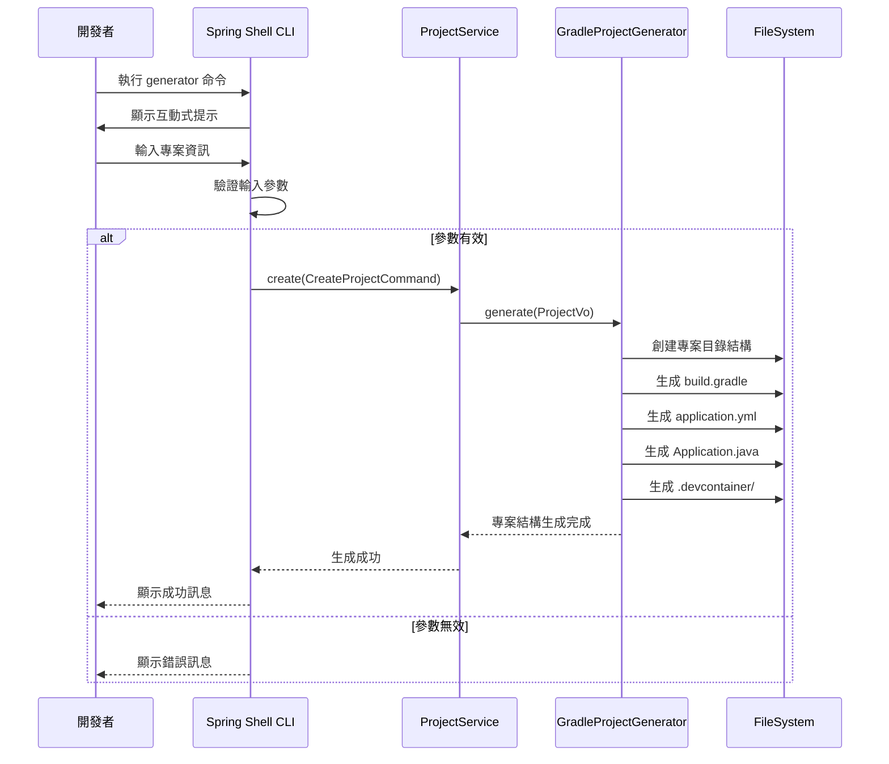
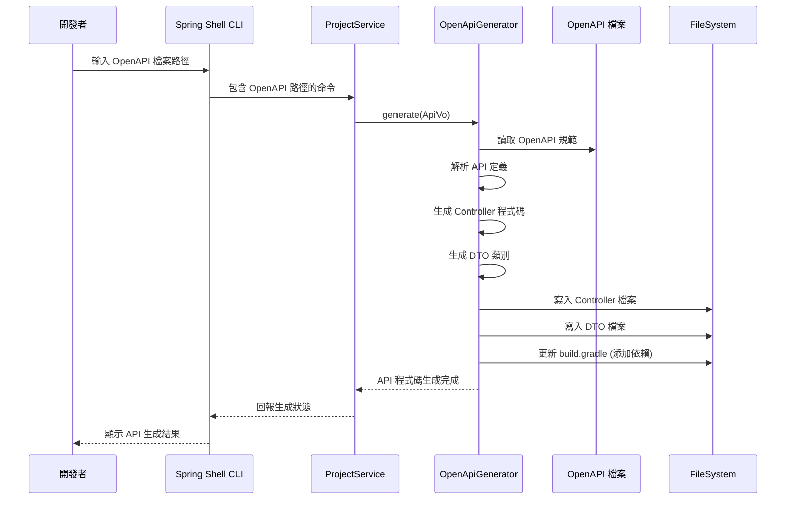
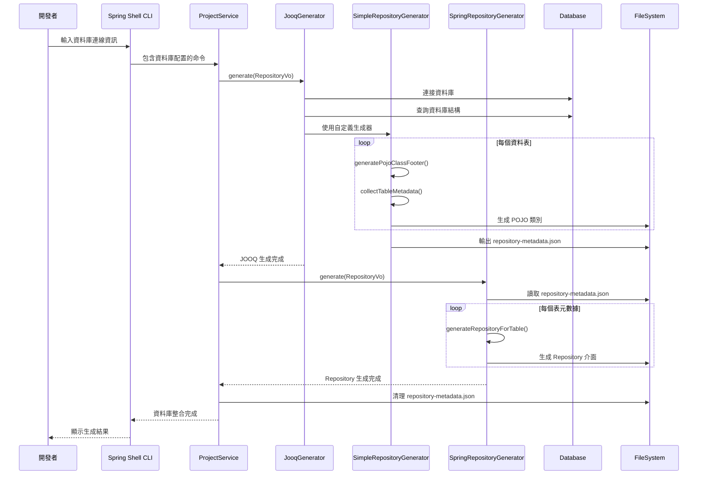
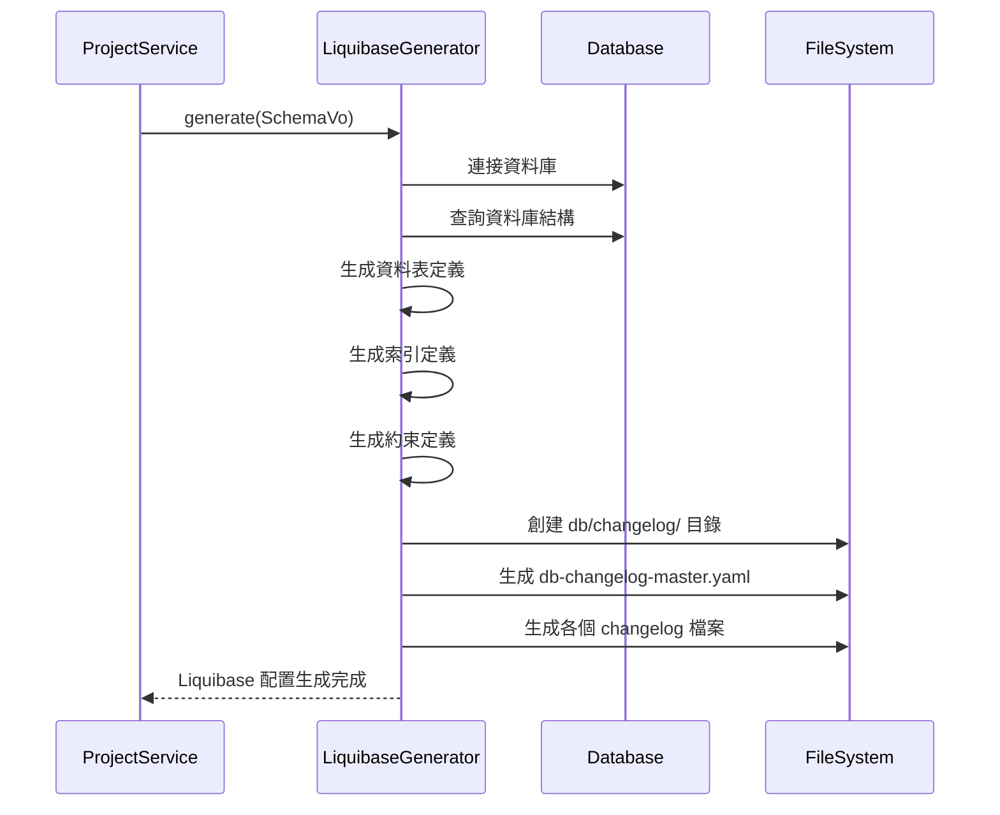
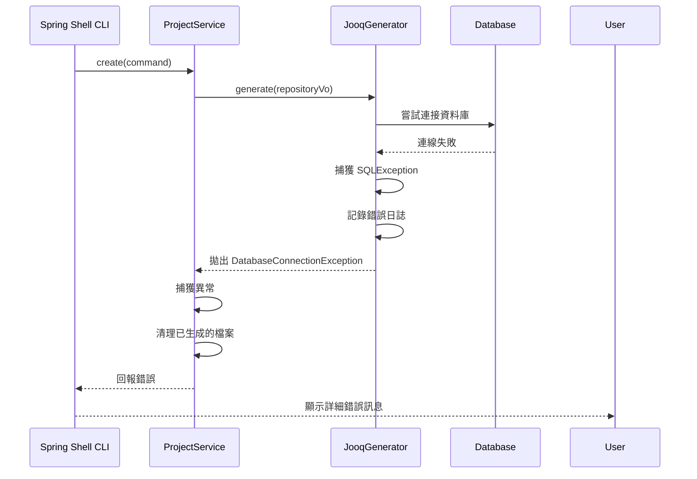
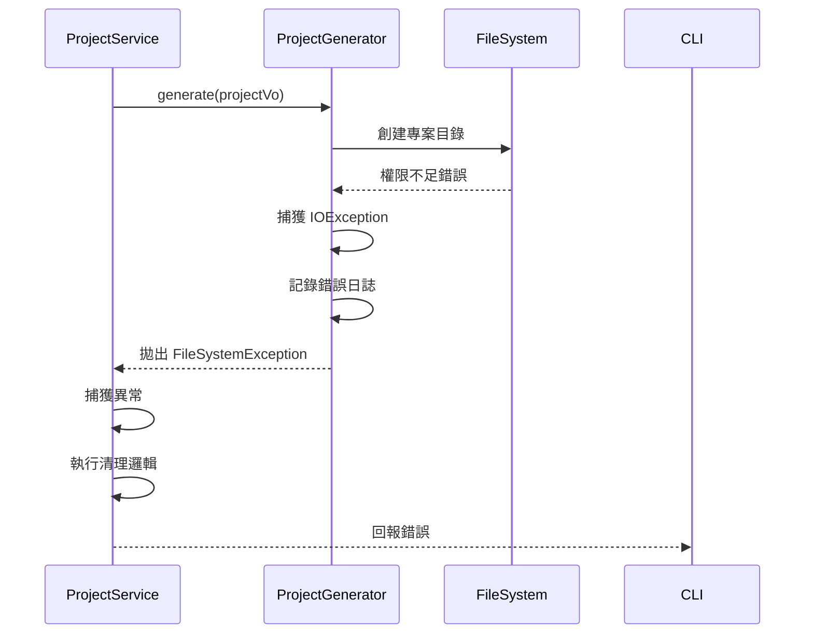
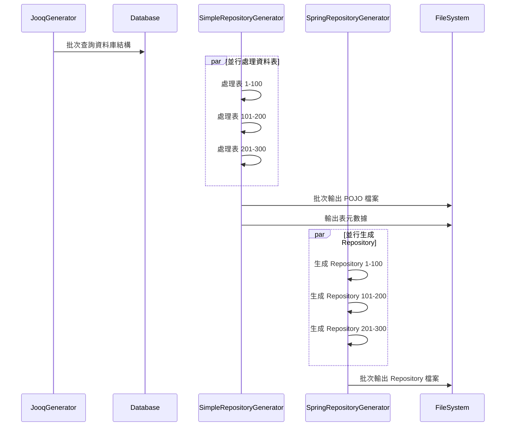
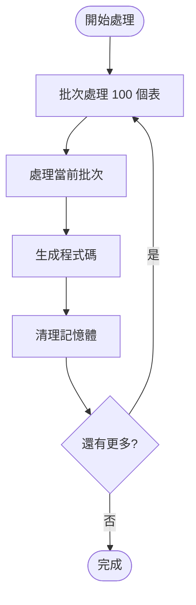
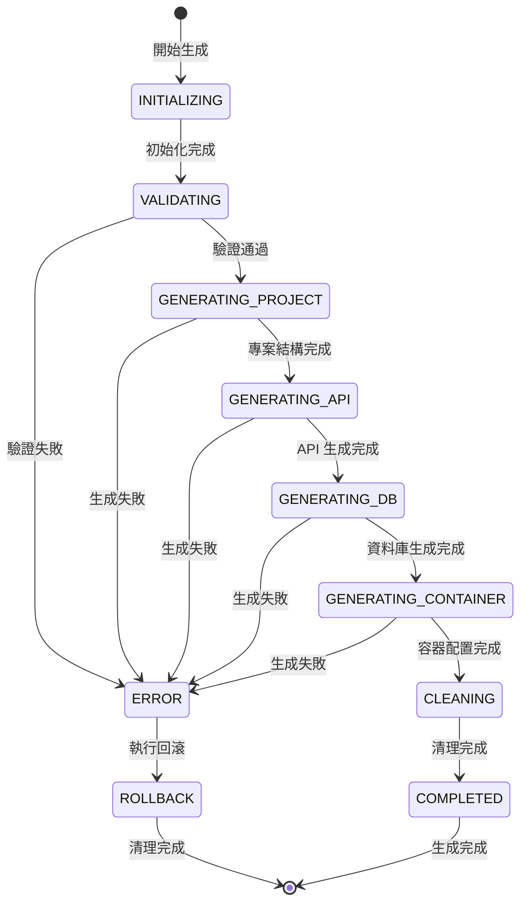

# 4. 運行時視圖 (Runtime View)

## 4.1 使用者故事運行時序列

### 4.1.1 US-001: 快速專案生成流程



### 4.1.2 US-002: OpenAPI 整合流程



### 4.1.3 US-003: 資料庫整合流程



### 4.1.4 US-005: Liquibase 整合流程



## 4.2 錯誤處理流程

### 4.2.1 資料庫連線失敗處理



### 4.2.2 檔案系統錯誤處理



## 4.3 效能關鍵路徑

### 4.3.1 大型資料庫處理



### 4.3.2 記憶體最佳化策略



## 4.4 併發處理模式

### 4.4.1 多執行緒生成策略

```java
@Service
public class ProjectService {
    private final ExecutorService executorService = 
        Executors.newFixedThreadPool(Runtime.getRuntime().availableProcessors());
    
    public void create(CreateProjectCommand command) {
        List<CompletableFuture<Void>> futures = new ArrayList<>();
        
        // 1. 並行生成不同類型的程式碼
        if (hasOpenApi(command)) {
            futures.add(CompletableFuture.runAsync(() -> 
                generateApiCode(command), executorService));
        }
        
        if (hasDatabase(command)) {
            futures.add(CompletableFuture.runAsync(() -> 
                generateDatabaseCode(command), executorService));
        }
        
        // 2. 等待所有任務完成
        CompletableFuture.allOf(futures.toArray(new CompletableFuture[0])).join();
        
        // 3. 最後生成容器化配置
        generateContainerConfig(command);
    }
}
```

## 4.5 狀態管理和事務性

### 4.5.1 生成流程狀態機



### 4.5.2 事務性保證機制

```java
@Component
public class TransactionalProjectGenerator {
    private final List<Path> generatedFiles = new ArrayList<>();
    private final List<Path> generatedDirectories = new ArrayList<>();
    
    public void generate(CreateProjectCommand command) {
        try {
            // 記錄所有生成的檔案和目錄
            generateWithTracking(command);
        } catch (Exception e) {
            // 發生錯誤時回滾所有變更
            rollback();
            throw e;
        }
    }
    
    private void rollback() {
        // 刪除所有生成的檔案
        generatedFiles.forEach(this::deleteQuietly);
        // 刪除所有生成的目錄
        generatedDirectories.forEach(this::deleteDirectoryQuietly);
    }
}
```

## 4.6 監控和可觀測性

### 4.6.1 生成進度追蹤

```java
@Component
public class ProgressTracker {
    private final List<ProgressListener> listeners = new ArrayList<>();
    
    public void reportProgress(String stage, int current, int total) {
        double percentage = (double) current / total * 100;
        ProgressEvent event = new ProgressEvent(stage, current, total, percentage);
        listeners.forEach(listener -> listener.onProgress(event));
    }
}
```

### 4.6.2 效能監控

```java
@Component
public class PerformanceMonitor {
    private final MeterRegistry meterRegistry;
    
    public <T> T measureTime(String operation, Supplier<T> supplier) {
        Timer.Sample sample = Timer.start(meterRegistry);
        try {
            return supplier.get();
        } finally {
            sample.stop(Timer.builder("generator.operation.duration")
                .tag("operation", operation)
                .register(meterRegistry));
        }
    }
}
```

## 4.7 資源管理

### 4.7.1 資料庫連線管理

```java
@Component
public class DatabaseConnectionManager {
    private final HikariDataSource dataSource;
    
    public <T> T executeWithConnection(String url, String username, String password, 
                                      ConnectionCallback<T> callback) {
        try (Connection connection = createConnection(url, username, password)) {
            return callback.execute(connection);
        } catch (SQLException e) {
            throw new DatabaseConnectionException("Failed to execute database operation", e);
        }
    }
}
```

### 4.7.2 記憶體管理

```java
@Component
public class MemoryManager {
    private static final int MAX_BATCH_SIZE = 100;
    
    public <T> void processBatches(List<T> items, BatchProcessor<T> processor) {
        for (int i = 0; i < items.size(); i += MAX_BATCH_SIZE) {
            List<T> batch = items.subList(i, Math.min(i + MAX_BATCH_SIZE, items.size()));
            processor.process(batch);
            
            // 強制垃圾回收以釋放記憶體
            if (i % (MAX_BATCH_SIZE * 10) == 0) {
                System.gc();
            }
        }
    }
}
``` 